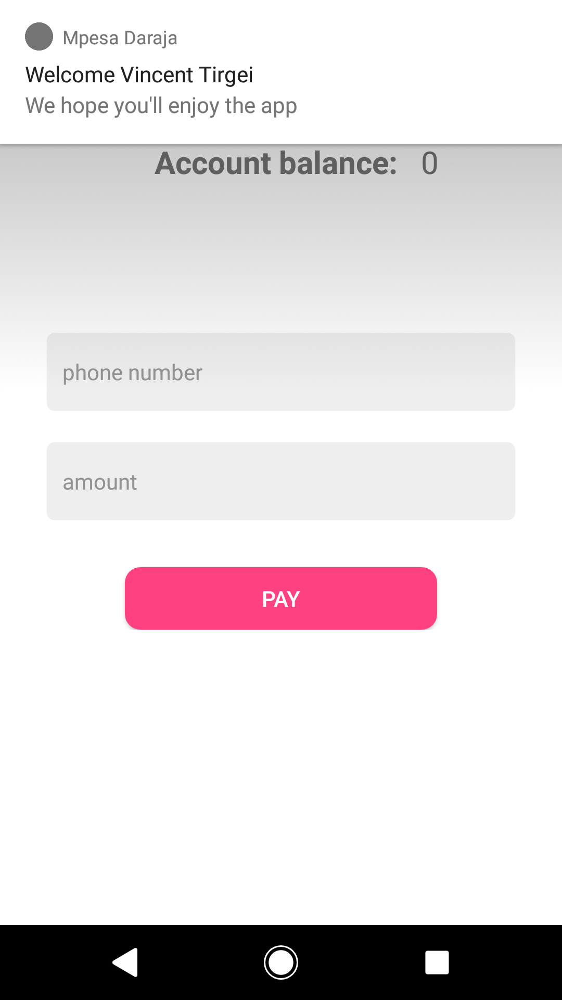
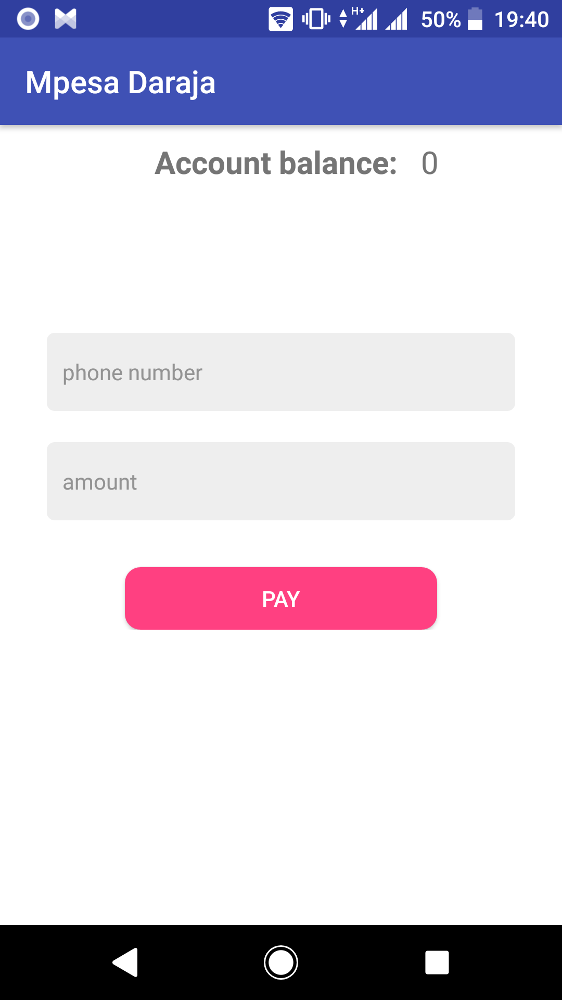
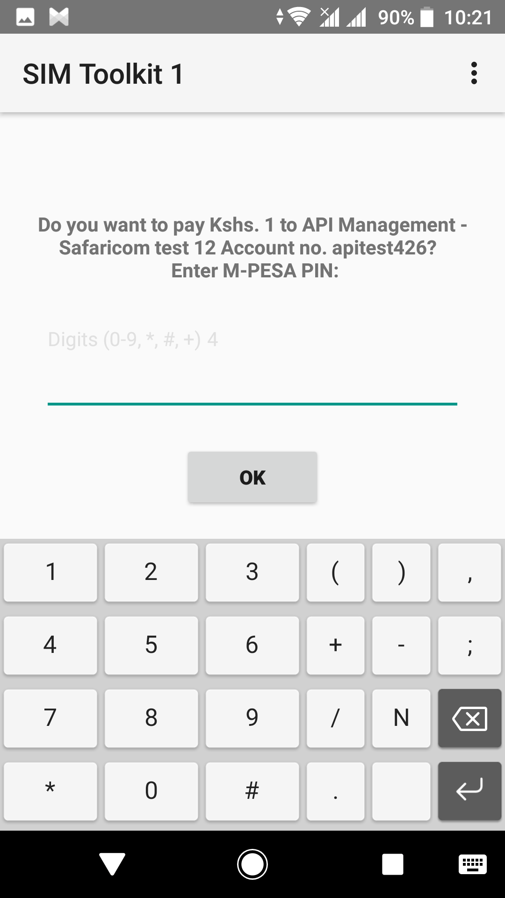
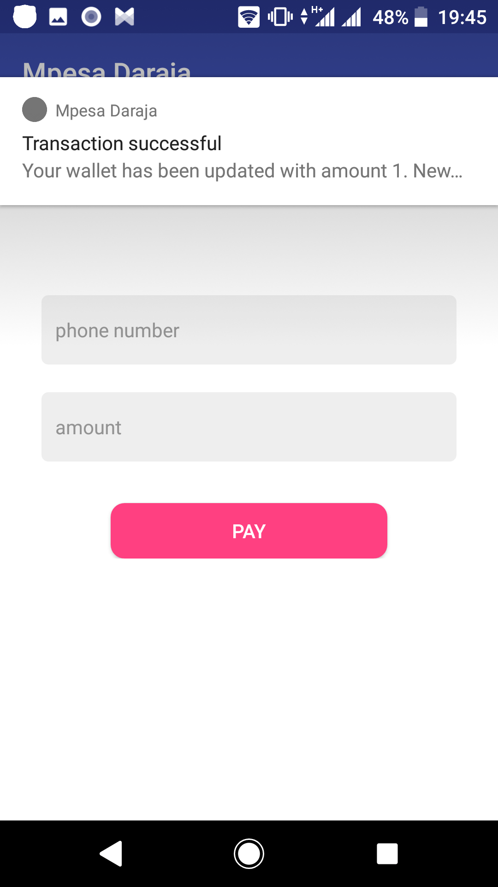
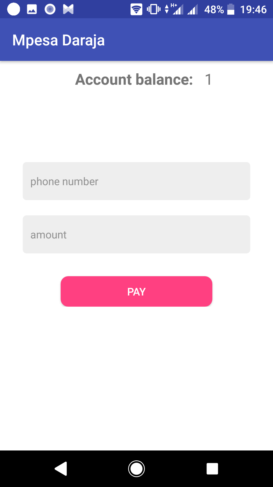

# Mpesa Daraja - Firebase cloud functions
This is the cloud functions for the Mpesa Daraja android mobile application (https://github.com/tirgei/MpesaDaraja).

In the project, cloud functions was used for:
* Welcoming a new user to the app
* Providing a callback endpoint for Safaricom which is triggered on STK push
* Providing an endpoint which is called on successful transaction so as to update account balance and   create a transaction entry in the database

The push notifications were sent via Google FCM

### Screenshots
 

 

To view the source code for the app, you can clone it here: https://github.com/tirgei/MpesaDaraja.git

Happy coding :)